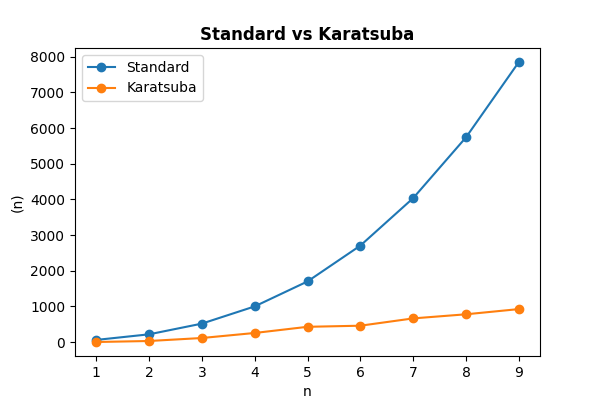

## Multiplication Algorithms

### Simple Multiplication Algorithm

This is a multiplication algorithm that is used in schools due to its simplicity. Multiplicand are being multiplied by each digit multiplier to get partial products and carries and then add up all the properly shifted results.

The time complexity of this code is $O(n^2)$ if the lengths of both multiplicand and multiplier are the same but if they are different, it will become $O(n * m)$, where $n$ and $m$ are the lengths of multiplicand and multiplier respectively.

### Karatsuba Algorithm

This is an efficient multiplication algorithm. It uses divide and conquer method and recursion to merge the sub calculations. 

The time complexity of this algorithm is $O(n^{\log_2 3}) \approx O(n^{1.585})$ which is more efficent than $O(n^2)$ (Karatsuba, 1995; Dosunmu, 2021). However, this algorithm can be slower than Simple Multiplication one for small values of $n$. 

### Results from Our Experiment

To analyse the comparison between these two multiplication algorihms, we use the lengths of multiplicands and multipliers, $n$ (assume both of them have the same length) and the count operations, $f(n)$ to denote the time complexity of the respective algorithms.

We obtained **5** sets of count operations for both Simple and Karatsuba multiplication algorithms, with $n$ ranging from 1 to 9 (inclusive). Each set represents a separate trial run of the algorithms. Then, we take the average of the count operations for each $n$ so that we can comprehend the algorithm's behaviour and account for any minor variations between trials. This provides a better reprensentative measure of the algorithms' efficiency and complexity.

#### Simple Multiplication

**Each set of the run:**

| n   | Count 1 | Count 2 | Count 3 | Count 4 | Count 5 |
|:---:|:-------:|:-------:|:-------:|:-------:|:-------:|
| 1   | 60      | 60      | 60      | 60      | 60      |
| 2   | 217     | 217     | 211     | 217     | 217     |
| 3   | 517     | 499     | 505     | 505     | 505     |
| 4   | 1000    | 976     | 982     | 982     | 994     |
| 5   | 1700    | 1688    | 1700    | 1688    | 1706    |
| 6   | 2705    | 2675    | 2693    | 2687    | 2705    |
| 7   | 4037    | 4007    | 4001    | 4007    | 4025    |
| 8   | 5742    | 5694    | 5696    | 5706    | 5718    |
| 9   | 7854    | 7818    | 7788    | 7830    | 7836    |

**Averaged results:**

| n   | Average Count |
|:---:|:-------------:|
| 1   |      60       |
| 2   |     215.8     |
| 3   |     506.2     |
| 4   |     986.8     |
| 5   |    1696.4     |
| 6   |     2693      |
| 7   |    4015.4     |
| 8   |    5711.2     |
| 9   |    7825.2     |

#### Karatsuba

**Each set of the run:**

| n   | Count 1 | Count 2 | Count 3 | Count 4 | Count 5 |
|:---:|:-------:|:-------:|:-------:|:-------:|:-------:|
| 1   | 60      | 60      | 60      | 60      | 60      |
| 2   | 217     | 217     | 211     | 217     | 217     |
| 3   | 517     | 499     | 505     | 505     | 505     |
| 4   | 1000    | 976     | 982     | 982     | 994     |
| 5   | 1700    | 1688    | 1700    | 1688    | 1706    |
| 6   | 2705    | 2675    | 2693    | 2687    | 2705    |
| 7   | 4037    | 4007    | 4001    | 4007    | 4025    |
| 8   | 5742    | 5694    | 5696    | 5706    | 5718    |
| 9   | 7854    | 7818    | 7788    | 7830    | 7836    |

**Averaged results:**

| n   | Average Count |
|:---:|:-------------:|
| 1   |      60       |
| 2   |     215.8     |
| 3   |     506.2     |
| 4   |     986.8     |
| 5   |    1696.4     |
| 6   |     2693      |
| 7   |    4015.4     |
| 8   |    5711.2     |
| 9   |    7825.2     |

#### Graph Plot

We use Python's Matplotlib to plot the graph for $n$ against $f(n)$.

#### Analysis from Graph

The graph above shows the comparison of the time complexities of Simple multiplication and the Karatsuba algorithms. The x-axis represents the input size or the length of both multiplicands and multipliers, $(n)$, while the y-axis represents the number of operations, $f(n)$.

After examining the shape of the curves, it is evident that the simple multiplication's curve shows a quadratic growth patten. This pattern is consistent with the $O(n^2)$ time complexity, where n is the number of digits in the numbers being multiplied. For instance the $f(n)$ difference between simple and Karatsuba when $(n) = 2$ is 50 while for $(n) = 9$ is 7000.

However, the Karatsuba's algorithm curve grows at a slower rate compare to the simple multiplication algorithm thus suggesting a better time complexity.

As the input size, $n$ increases, the vertical gap between two curves increases significantly. This gap shows that the difference in running times between the simple multiplication and Karatsuba's algorithms becomes more clear as $n$ increases.

The Karatsuba's algorithm's curve remains consistently lower than the simple multiplication, showing its superior efficiency for larger input sizes.

To sumamrise, this graph provides a crystal clear visual representation of the difference in time complexities between both multiplication algorithms. The simple multiplication algorithm's time complexity is $O(n^2)$ while the Karatsuba's $O(n^{\log_2 3})$ manifests in a slower growth rate (Wolfram Research, Inc., n.d.).

### References

1) Wolfram Research, Inc. (n.d.). Karatsuba Multiplication -- from Wolfram MathWorld. https://mathworld.wolfram.com/KaratsubaMultiplication.html

2) Karatsuba, A. A. (1995). The complexity of computations. Proceedings of the Steklov Institute of Mathematics, 211, 169–183. Retrieved from http://www.ccas.ru/personal/karatsuba/divcen.pdf 

3) Dosunmu, O. (2021, August 23). Karatsuba Algorithm (for fast integer multiplication). OpenGenus IQ: Learn Algorithms, DL, System Design. https://iq.opengenus.org/karatsuba-algorithm/

